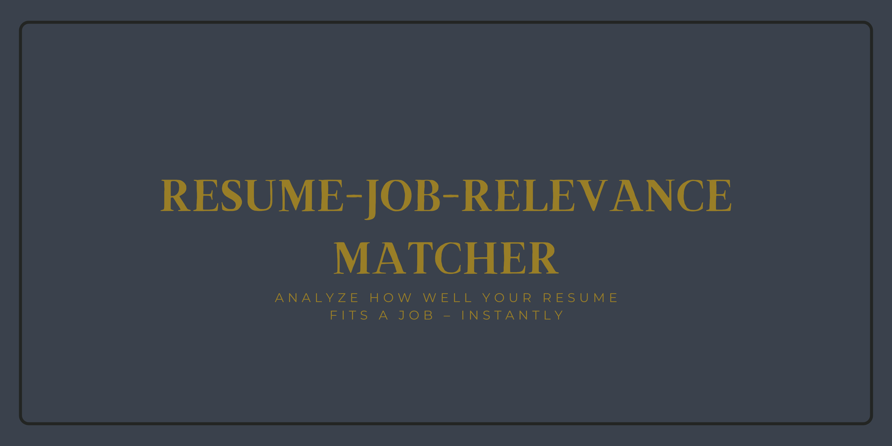
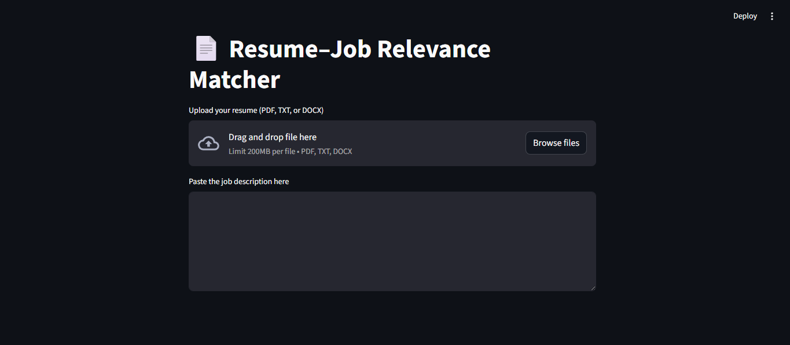
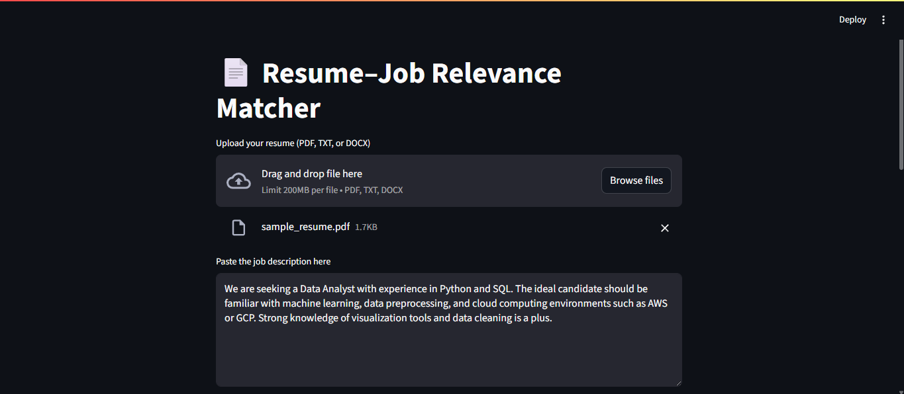
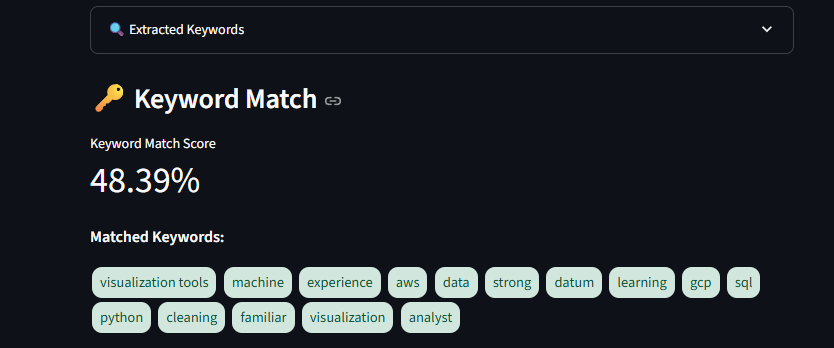
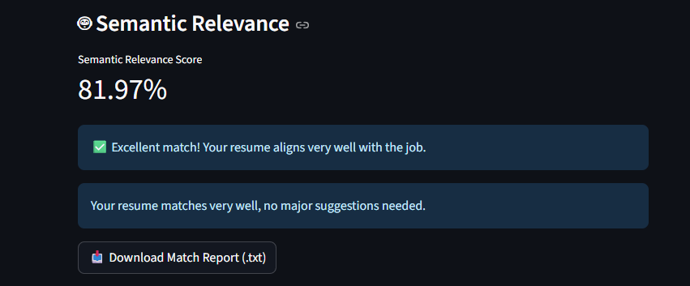
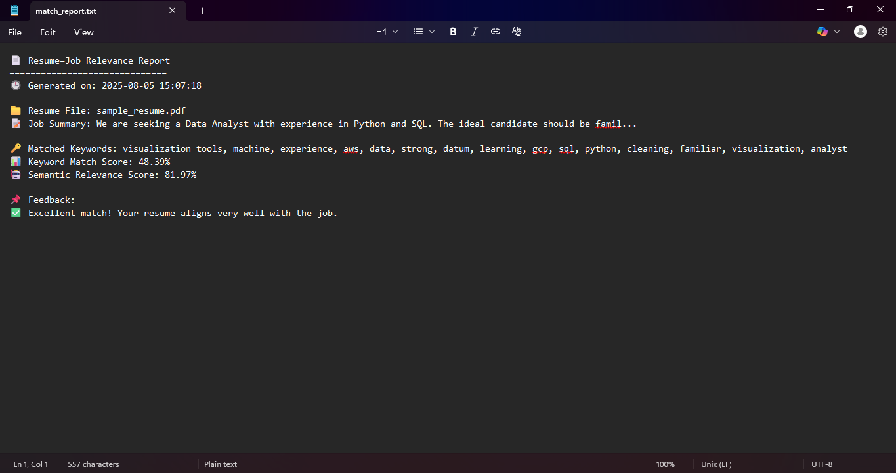

# Resume–Job Relevance Matcher


A Streamlit web app that analyzes how well a resume matches a job description using **keyword matching** and **semantic similarity with AI**.

## Features

- Upload resume (PDF, DOCX, or TXT)
- Paste job description
- Keyword extraction & fuzzy matching
- Semantic similarity using Sentence Transformers
- AI-powered resume improvement suggestions (OpenAI)
- Downloadable match report

## Tech Stack
- Python
- Streamlit
- spaCy
- Sentence Transformers
- RapidFuzz
- OpenAI GPT

## License
This project is licensed under the MIT License

## Contributions
Pull requests are welcome! Feel free to open issues or contribute directly.

## App Preview
- 
- 
- 
- 
- 

## Installation

1. Clone this repository:
   ```bash
   git clone https://github.com/Faiz2468/resume-job-matcher.git
   cd resume-job-matcher


P.S. If you found this useful or inspiring, consider starring the repo.